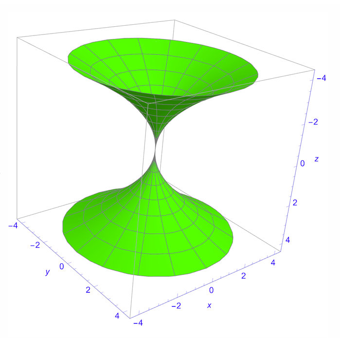
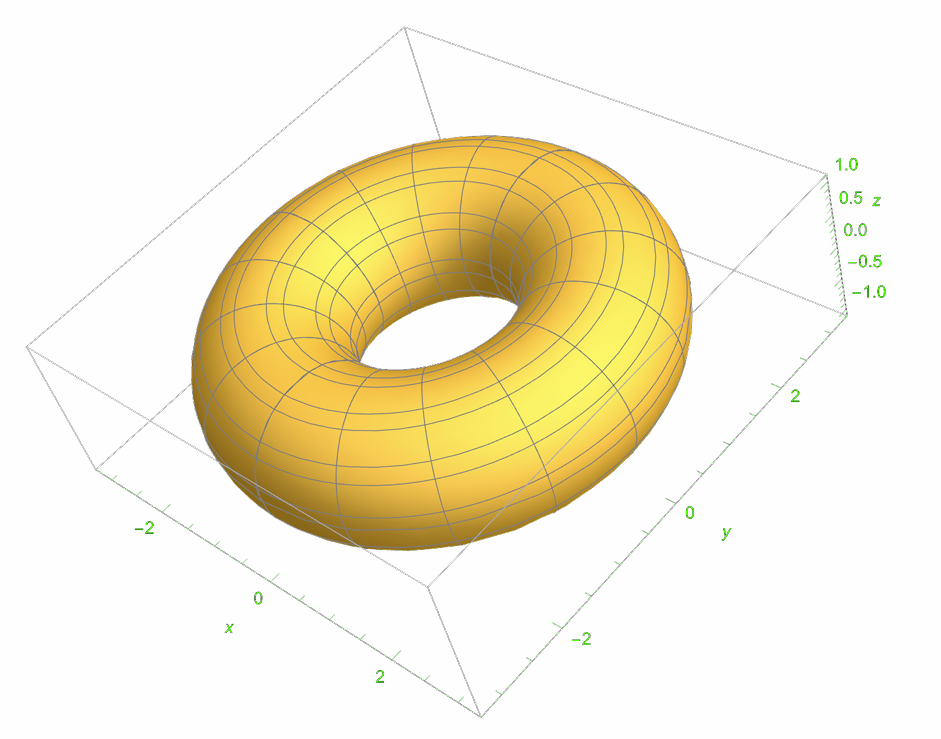
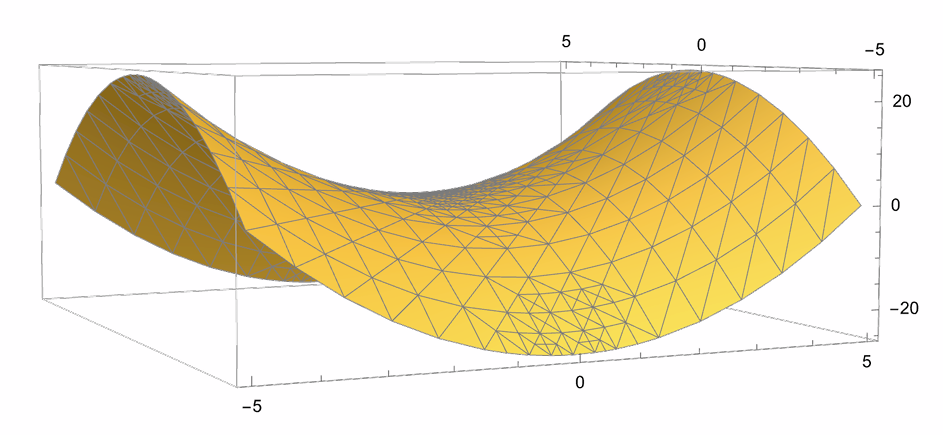
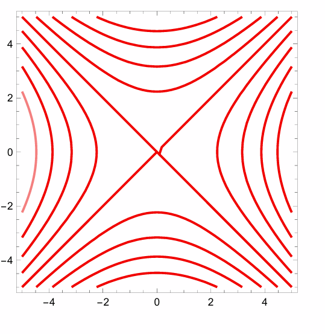
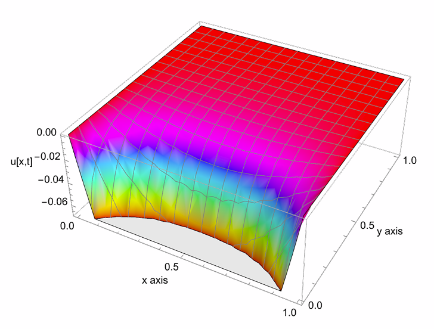
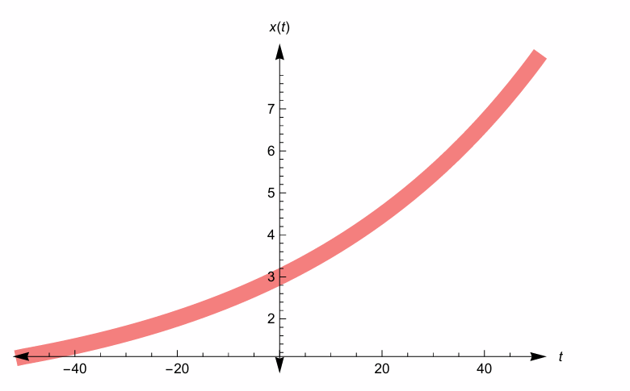

# Wolfram-Mathematica-Project

## Project Overview
This project demonstrates analytical and computational techniques in mathematical modeling using Wolfram Mathematica. It includes geometric visualization, partial differential equation solutions, and real-world modeling applications.

## 1. Surface of Revolution

-Constructed surfaces generated by revolving curves about an axis  
-Visualized 3D surfaces  
-Computed and plotted level curves corresponding to fixed heights

Concepts used:  
-Parametric equations  
-Multivariable calculus  
-3D plotting and contour analysis

### Surface of Revolution of Parabola 
$$y^2 = 4ax$$  
The surface is obtained by revolving the parabola 
$$y^2 = 4ax$$ about the x-axis.  
This generates a three-dimensional surface whose parametric representation is derived using cylindrical symmetry.

The resulting surface is visualized below:

  

### Surface of Revolution – Torus
The surface shown above is obtained by revolving the parametric curve  

$$
x = 2 + \cos t, \quad y = \sin t
$$

about the z- axis
This generates a toroidal surface (torus) or a donut like figure, characterized by circular symmetry and a central void. The geometry is visualized using RevolutionPlot3D in Wolfram Mathematica.

  

### Surface Plot and Level Curves
Function $$f(x,y) = x^2 - y^2$$

The function $$f(x,y) = x^2 - y^2$$ defines a hyperbolic paraboloid, commonly known as a saddle surface.
The surface exhibits opposite curvature along the x and y directions.

Level curves were obtained by fixing the height $$z=c$$, resulting in:

-Hyperbolas for 
$$c \neq 0$$  
-Intersecting straight lines when $$c=0$$

The surface and its mesh structure are visualized below:

  

  

## 2. Wave and Heat Equations
-Solved classical partial differential equations:  
->Wave Equation  
->Heat Equation  
-Generated analytical solutions  
-Plotted time-evolution graphs

Concepts used:  
-Second-order PDEs  
-Boundary conditions  
-Fourier methods  
-Numerical visualization

### Heat Equation Solution
Problem Statement  
$$\frac{\partial u}{\partial t} - \frac{\partial^2 u}{\partial x^2} = 0,
\quad 0 < x < 1\; t > 0$$

### Initial Condition

$$u(x,0) = x^2 - x$$

### Boundary Conditions

$$u(0,t) = 0, \quad u(1,t) = 0$$
The one-dimensional heat equation was solved numerically using NDSolve in Wolfram Mathematica.  
The surface plot below illustrates the temporal diffusion of the initial temperature distribution.

The solution demonstrates:  
Dissipation of heat over time  
Smoothing behavior characteristic of parabolic PDEs  
Convergence toward steady-state equilibrium

  

## 3. Growth and Decay Models
-Modeled exponential growth and decay processes  
-Applied to population growth and decay scenarios  
-Analyzed parameter sensitivity

Concepts used:  
-First-order differential equations  
-Exponential modeling  
-Real-world interpretation of parameters

### Exponential Growth Model
Mathematical Model

The exponential growth model is governed by the differential equation:  
$$\frac{dx}{dt} = kx, \quad k > 0$$

whose solution is:

$$x(t) = x_0 e^{kt}$$

### Application

Suppose a population grows at an annual rate of **2%**, with an initial population of **3 million**.

### Parameters

- $$x_0 = 3$$
- $$k = 0.02$$
- $$t = 10$$ years

The population after 10 years is:

$$x(10) = 3e^{0.2} \approx 3.6642$$

Thus, the model predicts a population of approximately **3.664 million** after 10 years.

  

## Tools Used
-Wolfram Mathematica  
-Analytical solving (DSolve / NDSolve)  
-2D & 3D visualization tools

## Skills Demonstrated
-Mathematical modeling  
-Analytical problem solving  
-PDE solving  
-Scientific visualization  
-Computational mathematics

## This project strengthens foundational mathematical modeling skills applicable in quantitative finance, risk modeling, and data analysis.
